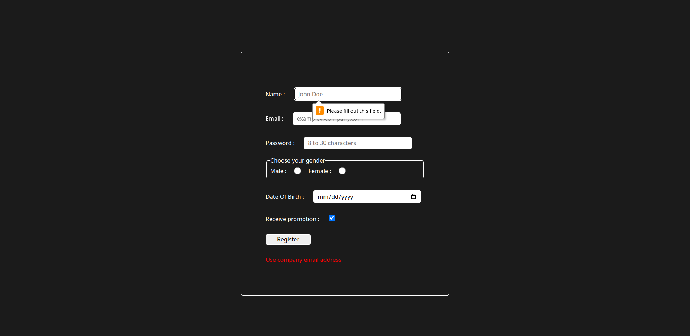

# personal-company-entry

# Links
- [Live preview](https://azanra.github.io/personal-company-entry/)

# About 
The project focus on using Model, View, Controller architecture
On the past project most of the process, start from the view 
instead of the controller. In this project the view and model 
doesn't know each other. And it's controller job to listen to 
event in the view and notify the model. And after that the model
will notify the controller that the process is already done, and
the controller will notify the view. 

In this project i try to create custom validation for the form.
Where not only i use the attribute validation. They will check if 
the email is already used or not. Also because i don't use the 
backend in this project. the event listener to process the data is 
put to the form instead of the button with the event type of submit.
And try to cancel the default behavior of the form to submit with
preventDefault so that i can process the data instead.

# Review
Some of the view class kinda similiar and redundant, i think i can use inheritance or override the method to not repeat myself. i will need to
properly study basic of object oriented programming later on. 

# Screenshot
